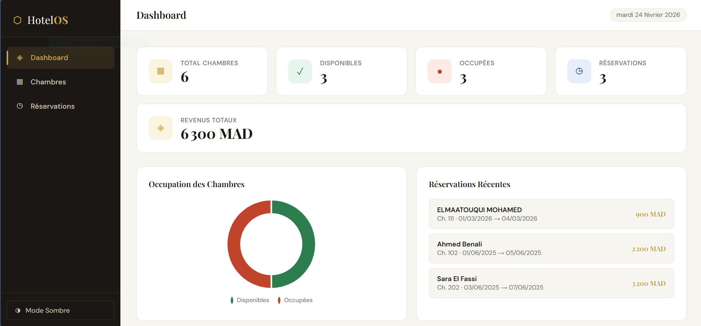

# 🚗 AutoFleet — Système de Gestion de Flotte Automobile

## 📋 Description

**AutoFleet** est une application web moderne pour la gestion de flotte automobile.  
Elle permet de gérer les voitures, les locations et les statistiques à travers une interface simple et responsive.

Ce projet est développé uniquement avec :

- ✅ HTML5
- ✅ CSS3
- ✅ JavaScript (Vanilla JS)
- ❌ Sans frameworks

---

## 🚀 Fonctionnalités

- 📊 Dashboard avec statistiques
- 🚘 Gestion des voitures
- 📅 Gestion des locations
- 👤 Gestion des clients
- 📱 Design responsive
- 💾 Stockage local avec LocalStorage

---

## 🛠️ Technologies Utilisées

- HTML5
- CSS3
- JavaScript
- LocalStorage API

---

## 📂 Structure du Projet
